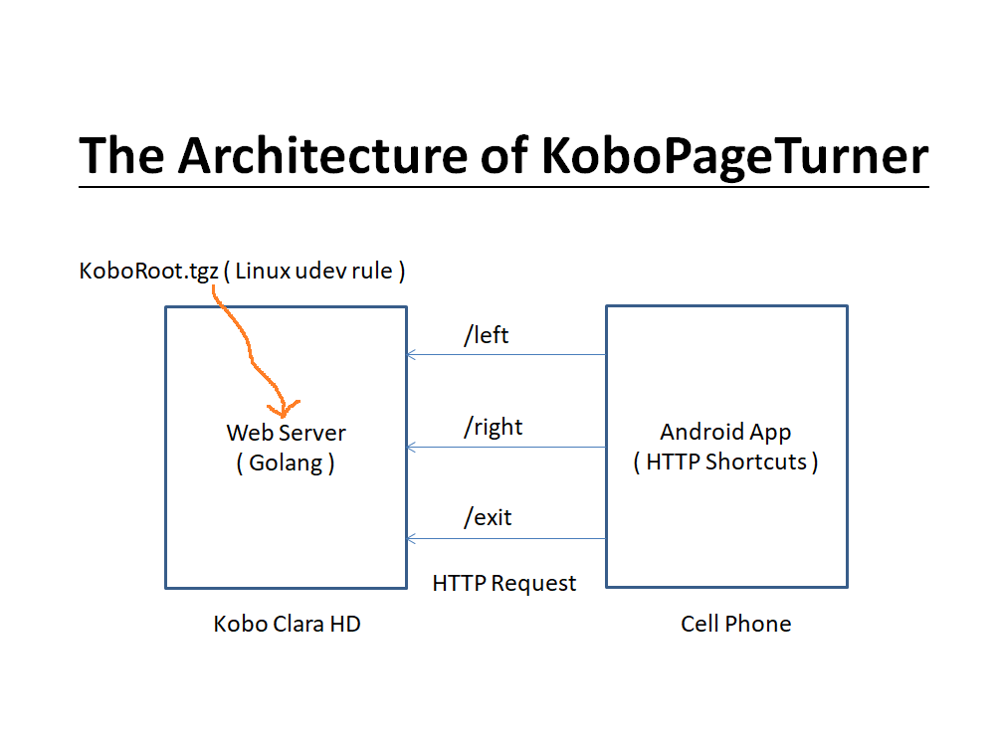

## KoboPageTurner
When I knew the KoboCloud project, I wanted to follow its concept to run a Web Server on Kobo device(Clara HD). When the Web Sever receives API, it will simulate to turn a page by sending touch event to touch panel.

## Architecture

## Usage
I used Kobo Clard HD to test this concept.

01. Run KoboServer/makeKoboRoot.sh to get KoboRoot.tgz.
02. Put KoboRoot.tgz to .kobo folder of your Kobo device.
03. Reboot device.
04. Turn on Wi-Fi on Kobo device. The Web Server will run on port 80.
05. Use Android(HTTP Shortcuts) to send HTTP request.
06. Use three API to control the Web Server.

* GET /left -> left page.
* GET /right -> right page.
* GET /exit -> shutdown the Web Server.

## Acknowledge
Thanks to KoboCloud. I got this idea from it.

## Licsnse
MIT.

