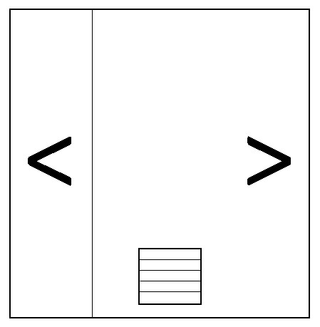

## KoboPageTurner
When I knew the KoboCloud project, I wanted to follow its concept to run a Web Server on Kobo device(Clara HD). When the Web Sever receives API, it will simulate to turn a page by sending touch event to touch panel.

It can run on different Kobo device in theory. Just make sure two things:
01. What is the touch panel of your Kobo device?
02. Do we adjust X or Y to match your panel ?

## Test Video
Please visit [here](https://youtu.be/ADpR_Omy-PE "KoboPageTurner").

## Architecture

## Usage
I used Kobo Clard HD to test this concept.

01. Run KoboServer/makeKoboRoot.sh to get KoboRoot.tgz.
02. Put KoboRoot.tgz to .kobo folder of your Kobo device.
03. Reboot device.
04. Turn on Wi-Fi on Kobo device. The Web Server will run on port 80.
05. Use Android(HTTP Shortcuts) to send HTTP request.
06. Use three API to control the Web Server.
* GET /left -> left page.
* GET /right -> right page.
* GET /exit -> shutdown the Web Server.

## My Page Setting
Actually I do not know the formula of pixelToValue when sending the touch event. I used "cat /dev/input/event1" to catch raw data. This my area setting to turn page.

## Note
This project is just prototype verification because I found the Wi-Fi of Clara HD is very bad. It often closes the Wi-Fi suddenly. I don't find a solution to solve it. If the Wi-Fi is closed, I must back to Home screen to turn on the Wi-Fi again. Then I can go on to read a book with my KoboPageTurner.

Update:
The Wi-Fi is closed automatically by Kobo system.

## Acknowledge
Thanks to KoboCloud. I got this idea from it.

## Licsnse
MIT.

