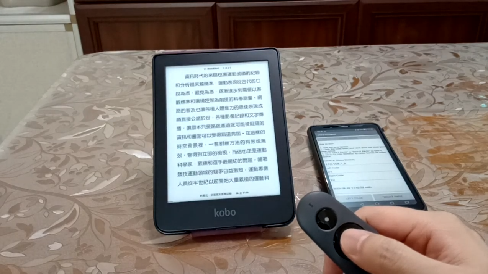

## KoboPageTurner

When I knew the [KoboCloud](https://github.com/fsantini/KoboCloud) project, I wanted to follow its concept to run a Web Server on Kobo device(Clara HD). When the Web Sever receives API, it will simulate to turn a page by sending touch event to touch panel.

It can run on different Kobo device in theory. Just make sure two things:
01. What is the touch panel of your Kobo device?
02. Do we adjust X or Y to match your panel ?

You could modify the settings of "/mnt/onboard/.koboserver/koboserver.cfg" for your Kobo device.
The origin point of Clara HD is right-top.
```
eventFile=/dev/input/event1
leftX=800
leftY=500
rightX=100
rightY=500
```

## Test Video
[Web Server + Android App(HTTP Shortcuts)](https://youtu.be/ADpR_Omy-PE "KoboPageTurner").

[Web Server + Android App(HTTPClient + Bluetooth keyboard)](https://youtu.be/PjRinWhRWPo "KoboPageTurner").

[Web Server + Android App(HTTPClient + Bluetooth page-turner(BOOX))](https://youtu.be/-BLY8ispxj8 "KoboPageTurner").

[Web Server + Android App(HTTPClient + Bluetooth page-turner(Logitech R500))](https://youtu.be/FerqFQrJcjs "KoboPageTurner").

## Architecture


## Installation
01. Run KoboServer/makeKoboRoot.sh to get KoboRoot.tgz or you could use release version.
02. Put KoboRoot.tgz to .kobo folder of your Kobo device.
03. Reboot device.

## Uninstallation
01. Edit "uninstall=true" in "/mnt/onboard/.koboserver/koboserver.cfg".
02. Turn on the Wi-Fi.
03. All materials will be deleted except "/mnt/onboard/.koboserver" folder.

## Usage
I used Kobo Clara HD to test this concept.  
System: 4.23.15505

01. Connect your Kobo device to PC.
02. Add below setting in the "/mnt/onboard/.kobo/Kobo/Kobo eReader.conf".
```
[DeveloperSettings]
EnableDebugServices=true
```
03. Go to "Settings" -> "Device Information" -> "Developer options".
04. Check "ForceWifiOn" item.
05. Connect your bluetooth device to your cell phone.
06. Turn on Wi-Fi on Kobo device. The Web Server will run on port 80.
07. Use Android(HTTPClient) to send HTTP request.
08. Modify settings.
```
Codes:
21 ->
22 <-
24 volume up
25 volume down

You could click the input area of code, and click your key, it will show your key code here.
```
09. Click "LEFT PAGE" or "RIGHT PAGE" to test the communication.
10. After closing the Web Server, uncheck "ForceWifiOn" item. Then turn off Wi-Fi.

## Caution
01. I used PID file to prevent from running two Web Servers in the same time. Please remember to close Server before you shutdown the device. Otherwise you must delete "/mnt/onboard/.koboserver/PID" to let Server works.
02. HTTPClient always keeps screen on. If you do not use it, remember to close the App.

## Three Web APIs
* GET /left -> left page.
* GET /right -> right page.
* GET /exit -> shutdown the Web Server.

## My Page Setting
Actually I do not know the formula of pixelToValue when sending the touch event. I used "cat /dev/input/event1" to catch raw data. This is my area setting to turn page.


## Note
This project is just prototype verification because I found the Wi-Fi of Clara HD is very bad. It often closes the Wi-Fi suddenly. I don't find a solution to solve it. If the Wi-Fi is closed, I must back to Home screen to turn on the Wi-Fi again. Then I can go on to read a book with my KoboPageTurner.

Update:
The Wi-Fi is closed automatically by Kobo system.

You colud add the setting in your "/mnt/onboard/.kobo/Kobo/Kobo eReader.conf". Maybe it will solve the Wi-Fi problem.
```
[DeveloperSettings]
ForceWifiOn=true
```

According to my test, if I used the "ForceWifiOn=true" setting, the Wi-Fi of Clara HD was always on even I turned off the Wi-Fi. I think this is not a good solution.

I tried to modify the "ForceWifiOn=true" setting when the Web Server ran, and modified the "ForceWifiOn=false" setting when the Web Server exited. However, this flow was not usefull. My Wi-Fi could not work after turning on or turning off the switch button many times. This flow is not the solution too.

Update(2020/08/04):
The final solution is to add "EnableDebugServices=true" in the "/mnt/onboard/.kobo/Kobo/Kobo eReader.conf". The side-effect is that you will have many system logs in "/mnt/onboard/.kobo". When you turn on Wi-Fi, it will have one log. You turn on Wi-Fi next time, you have another log again. The workaround is to delete these logs when calling "run.sh".
```
[DeveloperSettings]
EnableDebugServices=true
```
Then we must follow steps below to keep Wi-Fi on when we use KoboPageTurner.
01. Go to "Settings" -> "Device Information" -> "Developer options".
02. Keep "ForceWifiOn" true.
03. Turn on the Wi-Fi.
04. Use stable wireless network(optional, I must use my cell phone to get stable network for Clara HD).

## Acknowledgement
Thanks to [KoboCloud](https://github.com/fsantini/KoboCloud). I got this idea from it.

## Licsnse
MIT.
